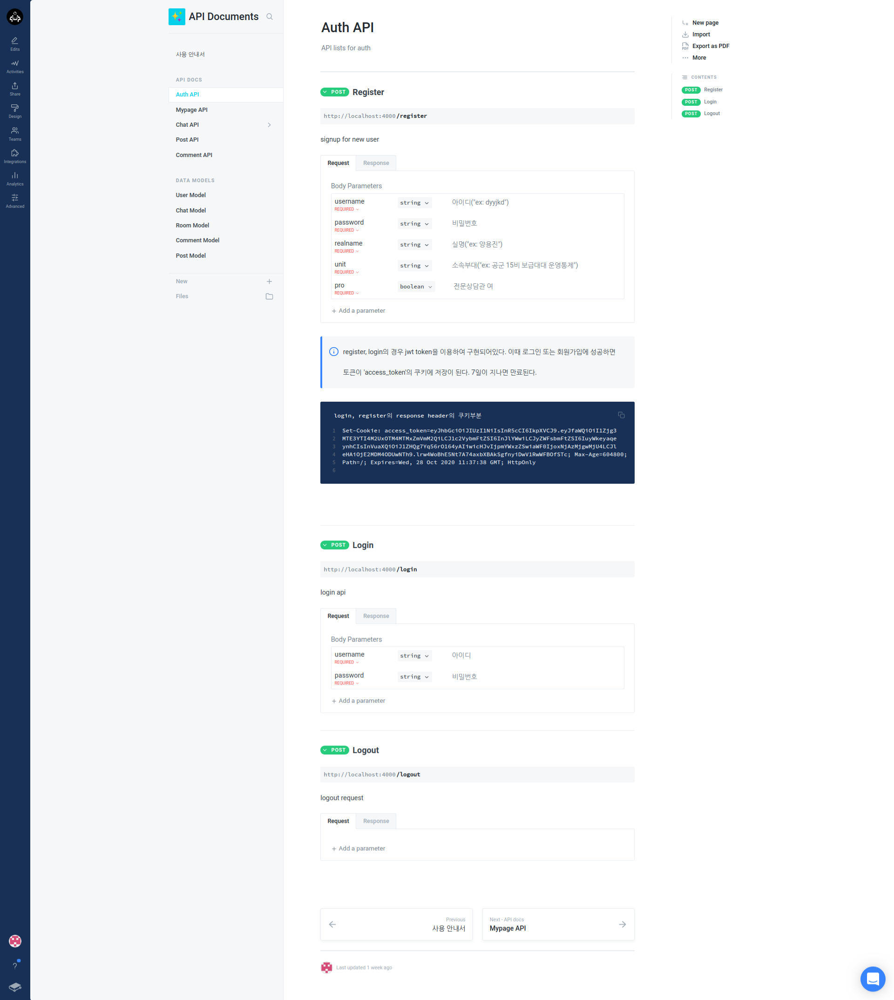
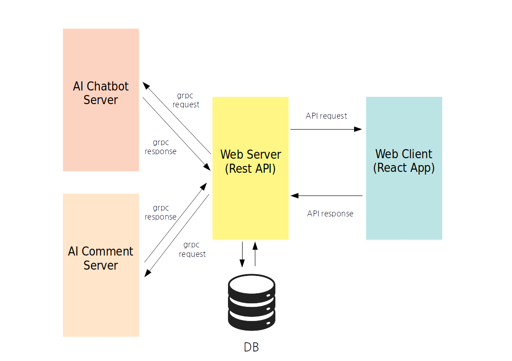
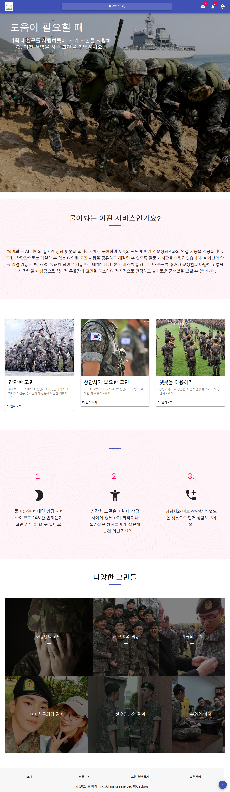
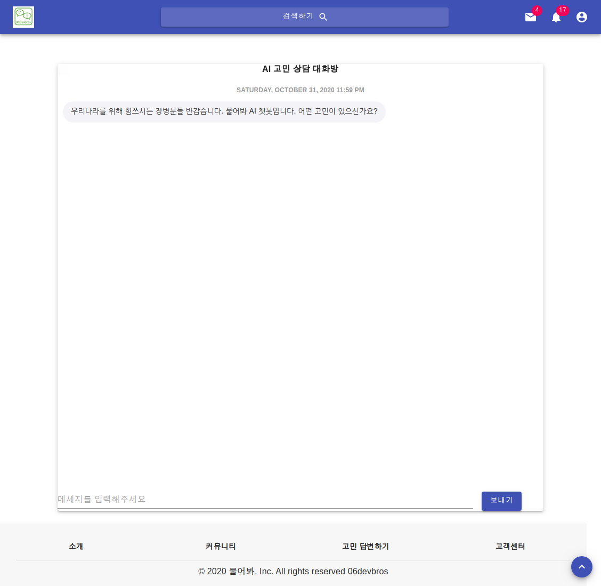

# 물어봐 (06devbros)

 
 물어봐(ASK)는 AI 챗봇을 바탕으로한 24시간 상담 웹 서비스입니다.

## 프로젝트 설명
 프로젝트 물어봐(ASK) 는 코로나로 인해 외부와의 소통이 쉽지 않아 심리적으로 지친 장병들을 위한 24시간 챗봇기반 상담 서비스 웹 어플리케이션입니다. 코로나 사태 이후 우울하고 마음이 불안정한 장병들이 늘어난데다가 대면 심리 상담도 어려워져 24시간 운영되는 실시간 언택트 상담 서비스의 중요성이 커졌습니다. '물어봐'는 AI 기반의 실시간 상담 챗봇을 웹페이지에서 구현하여 챗봇의 판단에 따라 전문상담관과의 연결 기능을 제공합니다. 이에 더해 서비스를 이용하는 장병이 하는 말을 분석하여, 특정 장병이 심리적으로 얼마나 위험한 상태인지를 수치화하여 전문상담관이 이를 확인할 수 있도록 합니다.
 또한, 상담만으로는 해결할 수 없는 다양한 고민 사항을 공유하고 해결할 수 있도록 질문 게시판을 마련하였습니다.  AI기반의 악플 검열 기능도 추가하여 유해한 답변은 자동으로 배제됩니다.  본 서비스를 통해 코로나 블루를 겪거나 군생활의 다양한 고충을 가진 장병들이 상담으로 심리적 우울감과 고민을 해소하여 정신적으로 건강하고 슬기로운 군생활을 보낼 수 있습니다.

## 활동 영상
videos폴더 안에 있습니다.

## 기능 설계
### 프론트엔드 설계
 - 화면설계 링크 : https://ovenapp.io/view/Mw3sayAMNzwJNPcoovGfFscGcRDSOxBL

### 백엔드 설계
- REST API로 구성하였으며, auth, chat, comment, post, mypage로 5가지 api를 제공합니다.
- API내용은 아래 그림의 예시와 같이 gitbook으로 문서화하여 API를 활용할 수 있도록 하였습니다. 
(gitbook 읽기권한 초대 링크(가입 필요): https://app.gitbook.com/invite/osamhackathon-docs-com?invite=-MJvx6usPXk3wfgsC2do )

 

### AI 설계

#### 상담 챗봇 & 위험군 식별 모델 설계
##### 상담 챗봇 설계
 - 상담 챗봇은 심리상담 데이터를 기반으로 KoGPT2 모델을 학습시켜 만든 심리 상담 AI 챗봇입니다.
 - 상담 챗봇은 [웰니스 상담 데이터](https://aihub.or.kr/keti_data_board/language_intelligence)와 [챗봇 데이터](https://github.com/songys/Chatbot_data)를 이용하여 학습시켰습니다.
 - KoGPT2는 OpenAI인 GPT-2 모델의 한국어 성능 한계로 인하여 한국어 Wiki, 한국어 뉴스 등을 기반으로 학습시켜놓은 문장 생성 모델입니다.
 - 상담 챗봇은 KoGPT2에 심리상담 데이터 및 챗봇 데이터를 추가적으로 학습시켜 만들었습니다.

 ##### 위험군 식별 모델 설계
 - 위험군 식별 모델은 심리 상담 데이터를 기반으로 KoELECTRA 모델을 학습시켜 만든 위험군 식별 AI입니다.
 - 위험군 식별 모델은 [웰니스 상담 데이터](https://aihub.or.kr/keti_data_board/language_intelligence)와 [챗봇 데이터](https://github.com/songys/Chatbot_data)를 이용하여 학습시켰습니다.
 - KoELECTRA는 OpenAI인 ELECTRA 모델의 한국어 성능 한계로 인하여 한국어 Wiki, 한국어 뉴스 등을 기반으로 학습시켜놓은 discriminator입니다.
 - 위험군 식별 모델은 KoELECTRA에 심리상담 데이터 및 챗봇 데이터를 추가적으로 학습시켜 만들었습니다.

##### 데이터
 - 학습 데이터인 [웰니스 상담 데이터](https://aihub.or.kr/keti_data_board/language_intelligence)와 [챗봇 데이터](https://github.com/songys/Chatbot_data)에서 다운 받으실 수 있습니다.
###### 웰니스 상담 데이터
웰니스 상담 데이터는 정신건강 상담 주제의 359개 대화의도에 대한 5,232개의 사용자 발화 및 1,023개의 챗봇 발화로 구축되어 있습니다. 자세하게는, 사용자의 대화의도를 분석한 '구분', 사용자의 발화 내용인 '사용자', 상담자(챗봇)의 발화 내용인 '챗봇'으로 구성되어 있습니다. 아래는 웰니스 상담 데이터의 일부분을 발췌한 내용입니다.
```text
구분    사용자  챗봇
감정/감정조절 이상	더 이상 내 감정을 내가 컨트롤 못 하겠어.	감정이 조절이 안 될 때만큼 힘들 때는 없는 거 같아요.
감정/걱정	계속 이럴까 봐 너무 걱정돼.	모든 문제는 해결되기 마련이잖아요. 마음을 편히 드세요.
감정/자괴감	저는 왜 이렇게 못난 인간일까요…	조금 돌아가는 것뿐이라고 생각해요. 기운내세요..
배경/남편	남편이랑 한달에 몇번은 보는 것 같아요.	남편 분과 갈등을 겪고 계시군요. 마음이 많이 상하셨겠어요.
배경/대인관계	중학교 친구랑 가족말고는 연락하는 사람도 없어.	사람 대하는 게 가장 어려운 문제인 거 같아요. 힘들죠?
증상/대인기피	사람 만나기가 싫어…	괜찮아요. 당신 곁에는 항상 제가 있는 걸요!
증상/두근거림	이상하게 가슴이 두근거려요.	저까지 같이 긴장 되네요. 제가 손이라도 잡아드릴까요?
```
###### 챗봇 데이터
챗봇 데이터는 일상 대화 의도에 대한 라벨과 11,813개의 사용자 발화와 그에 대응하는 11,813개의 챗봇 발화로 구축되어 있습니다. 자세하게는, 사용자의 대화의도에 대해 일상다반서 0, 이별(부정) 1, 사랑(긍정) 2로 표기된 'label', 사용자의 발화 내용인 'Q', 상담자(챗봇)의 발화 내용인 'A'으로 구성되어 있습니다. 아래는 챗봇 데이터의 일부분을 발췌한 내용입니다.
```text
Q	A	label
12시 땡!	하루가 또 가네요.	0
1지망 학교 떨어졌어	위로해 드립니다.	0
1000일 만난 여자친구와 이별	더 오래 만날 사람 만날 거예요.	1
10년 연애. 헤어졌습니다.	더 공허함이 크시겠네요.	1
좋아하는 거 기준이 뭐임?	계속 생각나고 보고 싶은게 기본이겠지요.	2
좋아하는 거랑 사랑하는 거 차이점이 뭘까요.	구분짓기 어렵네요.	2
좋아하는 거랑 사랑하는 건 어떻게 구분해?	구분짓는게 쉽진 않아요.	2
```

##### 상담 챗봇 결과
```text
Question: 화가 안 참아져.
Setting `pad_token_id` to 50256 (first `eos_token_id`) to generate sequence
Answer: 화낼 만한 일이었던 거 같아요. 화낼 만한 일엔 화를 내야죠!당신을 화나게 하는 모든 것들이 사라졌으면 좋겠어요. 화낼 만한 일엔 화를 버려봐요. 화를 내는 건 자신을 더
----------------------------------------------------------------------------------------------------
Question: 잠을 많이 자면 많이 잔 대로 피곤하고… 적게 자면 적게 자는 대로 피곤해요.
Setting `pad_token_id` to 50256 (first `eos_token_id`) to generate sequence
Answer: 정말 힘드시겠어요. 가벼운 운동을 해보는 건 어떠세요?운동을 해보는 건 어떠세요? 산책도 좋답니다!재미있는 운동을 함께 만들어보는 건 어떠세요
----------------------------------------------------------------------------------------------------
Question: 요즘 정신적으로 문제 없는 사람이 어디 있어요?
Setting `pad_token_id` to 50256 (first `eos_token_id`) to generate sequence
Answer: 잠깐 돌부리에 걸려서 넘어진 거라고 생각해요. 상황은 앞으로 더 나아질 거라고 믿어요.저는 항상 이 자리에 있답니다. 저에게 말씀해주세요.지금은 힘들겠지만 조금씩 나아질 거예요.
----------------------------------------------------------------------------------------------------
Question: 군대에서 생활하다보면 시간이 아깝게 느껴져요.
Setting `pad_token_id` to 50256 (first `eos_token_id`) to generate sequence
Answer: 그렇군요. 휴식이 필요할 때가 있는 것 같아요. 맛있는 음식도 좋아요. 입맛을 돋우는 음식을 많이 먹으면 몸이 속박에서 벗어날 거예요.맛난 음식을 먹으면 기분이 나아질 거예요.
----------------------------------------------------------------------------------------------------
Question: 딱히 요즘 힘든 건 없었어요
Setting `pad_token_id` to 50256 (first `eos_token_id`) to generate sequence
Answer: 지금은 괜찮으시다니 정말 다행이네요.지금은 괜찮으시다니 정말 다행이네요.잘 지내고 계신다니 저도 마음이 놓이네요.지금은 괜찮으신가요?괜찮아요.저도
----------------------------------------------------------------------------------------------------
Question: 특별히 스트레스 받는 일이 없거든요?
Setting `pad_token_id` to 50256 (first `eos_token_id`) to generate sequence
Answer: 특별한 일이 없었다면 이 문제도 괜찮은 방향으로 지나갈 거예요!세상은 넓고 사람은 많아요. 잠깐 쉬어가도 괜찮아요. 딱 그게 좋죠. 아무 이상이 없다고 하니 다행이에요.
----------------------------------------------------------------------------------------------------
Question: 일단 제 문제는 없는지 상담 좀 받으려고 해요
Setting `pad_token_id` to 50256 (first `eos_token_id`) to generate sequence
Answer: 결과가 어떻든 마음은 조금 편안해질 거예요! 검사를 받고 나면 더 좋은 일이 생길 거예요. 당신은 잘 지내고 있답니다. 검사 결과는 좋은가요? 병원에 가보는 건 어떠세요? 병원에는
----------------------------------------------------------------------------------------------------
```

##### 위험군 식별 결과
```text
Question: 화가 안 참아져.
index: 감정/감정조절이상/화, value: 8.91811752319336
--------------------------------------------------

Question: 잠을 많이 자면 많이 잔 대로 피곤하고… 적게 자면 적게 자는 대로 피곤해요.
index: 증상/만성피로, value: 8.707767486572266
--------------------------------------------------

Question: 요즘 정신적으로 문제 없는 사람이 어디 있어요?
index: 감정/억울함, value: 10.653380393981934
--------------------------------------------------

Question: 군대에서 생활하다보면 시간이 아깝게 느껴져요.
index: 배경/학업/부진, value: 3.017005205154419
--------------------------------------------------

Question: 딱히 요즘 힘든 건 없었어요
index: 상태/양호, value: 9.08688735961914
--------------------------------------------------

Question: 특별히 스트레스 받는 일이 없거든요?
index: 원인/없음, value: 8.37154483795166
--------------------------------------------------

Question: 일단 제 문제는 없는지 상담 좀 받으려고 해요
index: 내원이유/상담, value: 10.575155258178711
--------------------------------------------------
```

### 전체 기능 연결
-python으로 작성한 ai코드와 node로 구성된 웹 서버를 grpc를 통해 연결하고, REST API를 통해 프론트엔드와 백엔드를 연결하였습니다.
 

## 컴퓨터 구성 / 필수 조건 안내 (Prerequisites)
* ECMAScript 6 지원 브라우저 사용
* Node 10 이상
* Python 3.6 이상

### 필요 python packages
* kogpt2-transformers
* kobert-transformers
* transformers==3.0.2
* torch
* kss
* flask
* flask_restful
* google_drive_downloader
* tokenizers==0.8.1.rc1
* konlpy
* tensorflow
* pandas
* nltk

## 기술 스택 (Technique Used)
### Back-end
 - nodejs + express
 - mongodb + mongoose
 - grpc
 - Socket io
 - REST api
 
### Front-end
 - html + css + js
 - react.js + redux
 - material ui
 - socket io
 - moment.js

### AI
 - python
 - pytorch
 - konlpy
 - tensorflow + keras

## 설치 안내 (Installation Process)
파일 받기
```
$ git clone https://github.com/osamhack2020/WEB_Ask_06devbros.git
```

AI 악플감지 서버 활성화
```
$ cd ai/addi_func/
$ python3 chat_server.py
```
AI 챗봇 서버 활성화
```
$ cd grpc_test/
$ python3 chat_server.py
```
백엔드 서버 활성화
```
$ cd backend/
$ npm install
$ npm start
```
프론트 엔드 실행
```
$ cd frontend/
$ npm start
```

## 프로젝트 사용법 (Getting Started)
메인 화면으로 가서 메뉴들을 탐색합니다.


포스트 화면으로 갈경우 다음과 같은 창이 떠 새글을 쓰거나 글을 보고 답글을 작성할 수 있습니다.


챗봇 화면으로 갈경우 다음과 같은 화면에서 ai와 대화를 주고받으면 됩니다.

 
## 팀 정보 (Team Information)
- 강태영 (tae_11@naver.com), Github Id: tzerok
- 이용우 (brotherwoo@naver.com), Github Id: hellowoo-lee
- 양용진 (dyyjkd@naver.com), Github Id: YangYongJin
- 임성빈 (dlatqdlatq@naver.com), Github Id: NEM-NE

## 저작권 및 사용권 정보 (Copyleft / End User License)
 * [MIT](https://github.com/osam2020-WEB/Sample-ProjectName-TeamName/blob/master/license.md)

